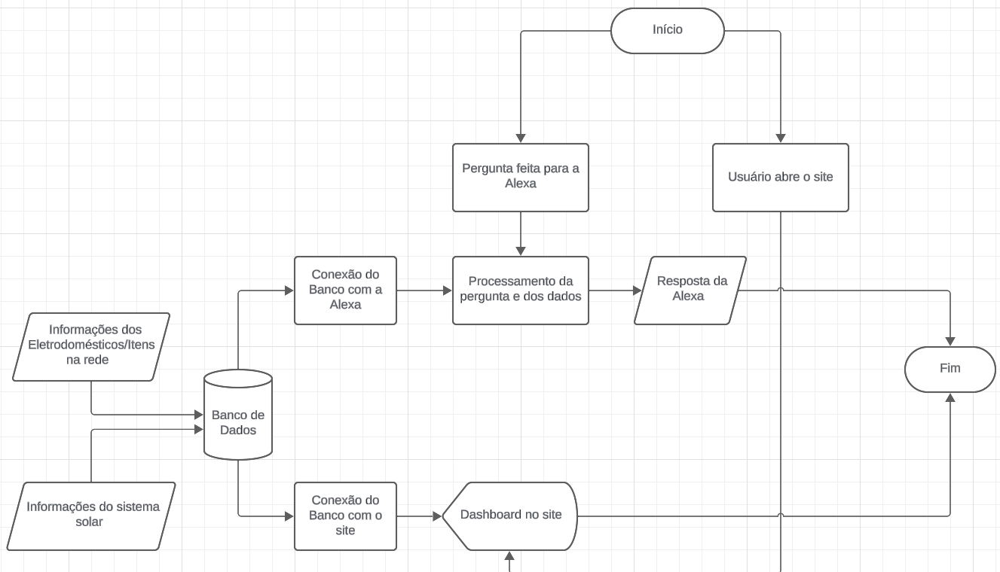

# Sprint-04---Pensamento-Computacional-e-SERS

## Solar Pulse
Nome: Guilherme Spranger dos Santos -> RM: 564059

Nome: Gustavo Lemos Diógenes -> RM: 565579

Nome: Pedro Paulo Barbosa Ross -> RM: 563038

Nome: Samuel de Souza Jorge -> RM: 558966

## Descrição do projeto

O projeto Solar Pulse, feito para o challenge em parceria com a GoodWe, visa a integração da rede solar do usuário com o sistema de assistente virtual da Amazon (Alexa), além de com uma dashboard acessível através de uma página web, oferecendo uma visão detalhada das informações energéticas, além de um controle completo dos dispositivos e eletrodomésticos integrados a rede.

A integração se dá início nos dispositivos da rede, que a todo momento estarão fornecendo dados ao banco de dados central, que também é conectado ao sistema de energia solar. Com o fornecimento dos dados ao banco de dados, eles ficam disponíveis por 2 formas, sendo a primeira via dashboard, onde o usuário consegue ter uma visão completa dos dados disponíveis no banco de dados, como energia gerada no dia, o gasto de energia pela rede, além de ter acesso a gráficos e relatórios detalhados.

Já por parte da Alexa, foi desenvolvida uma skill onde, quando a mesma é acionada pelo usuário, é possivel solicitar diversos dados sobre a rede elétrica, como consumo do dia, energia gerada, entre outros dados, além de permitir o controle dos dispositivos ligados a rede.

Mais abaixo, podemos ver um diagrama completo, demonstrando todas as integrações existentes no projeto.

## Alinhamento do projeto com o challenge GoodWe e com as disciplinas

Analisando toda a proposta do projeto desenvolvido ao longo do desafio, é possível notar que o mesmo está alinhado com os itens propostos no challenge GoodWe, assim também com os conteúdos propostos nas disciplinas de Pensamento Computacional e SERS.

Em relação com o challenge, é possível ver o alinhamento pela integração com a assistente virtual Alexa, além da conexão com os equipamentos solares GoodWe que fazem parte da rede, oferecendo uma grande facilidade na consulta das informações e no controle da rede solar.

Em relação às matérias, podemos ver as técnicas de programação e algoritmo por todo o código do projeto, que foi desenvolvido em Python, se alinhando com a matéria de Pensamento Computacional, além das análises de dados energéticos e exploração de datasets da área, se alinhando com a matéria de SERS.

## Resultados obtidos

Através da análise de todo o projeto, podemos verificar que o mesmo ofereceu resultados satisfatórios com o que foi proposto.

A skill da alexa, juntamente com a dashboard, ofereceram resultados concretos e completos, permitindo visualização e análise dos dados energéticos da rede solar e dos dispositivos conectados a mesma, além de permitir o controle dos dispositivos por parte do usuário, fazendo com que o mesmo tenha um controle total sobre a produção e gasto de energia da rede.

## Benefícios do projeto

Avaliando os resultados do projeto, podemos visualizar os benefícios em inovação e sustentabilidade que o mesmo tras.

O controle tanto do gasto energético quanto da produção de energia, ajudam na economia e na redução do desperdício de energia elétrica, oferecendo melhorias no quesito de sustentabilidade.

Já no quesito de inovação, podemos levar em conta a consulta de informações através da Alexa, além da visualização de gráficos e relatórios através do dashboard, ofertando um diferencial na consulta de dados e controle energético do sistema solar.

## Referências do projeto (Referências e conexões com frameworks, ferramentas, linguagens e sensores utilizados)

Dentre todos os componentes do projeto, os principais pontos a se destacar são o uso do Alexa Skill Kit para o desenvolvimento da skill, e o uso da linguagem de programação Python para o desenvolvimento da dashboard.

Já sobre os frameworks utilizados, nós utilizamos os seguintes para a construção do dashboard: Streamlit, Pandas, Matpotlib e Numpy.
